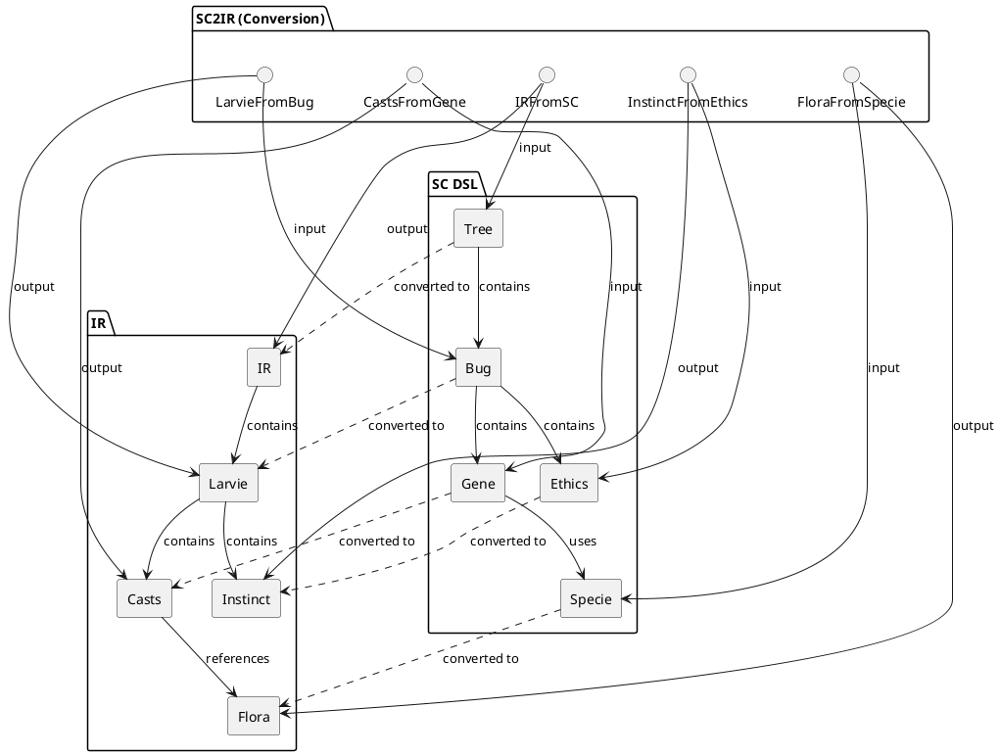
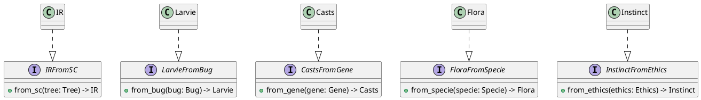
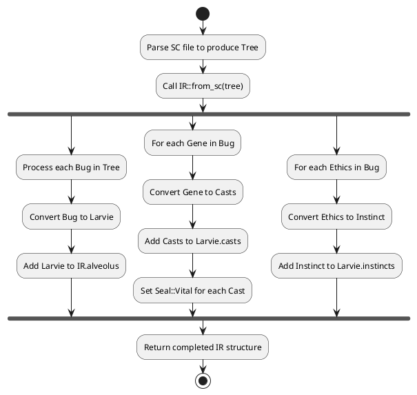
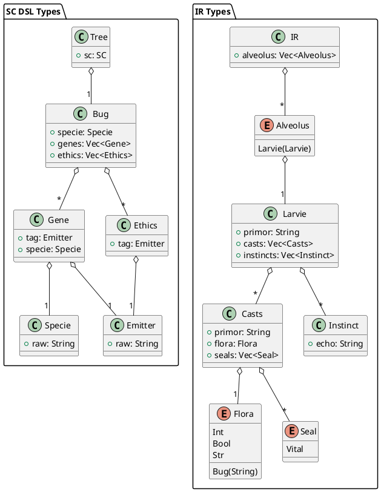

# SC2IR Architecture Documentation

This document provides a high-level overview of the SC2IR system architecture, which is responsible for converting SC language structures into IR (Intermediate Representation).

## System Overview

The SC2IR system is designed to transform code written in SC DSL into an intermediate representation (IR) that can be used for further processing. The system follows a trait-based architecture where different components handle specific conversion tasks.

### Key Components:

- **SC DSL Side**:
  - `Tree`: The parsed syntax tree from SC code
  - `Bug`: A definition of an entity in SC
  - `Gene`: An attribute definition within a Bug
  - `Ethics`: A behavior definition within a Bug
  - `Specie`: A type specification

- **IR Side**:
  - `IR`: The top-level IR structure
  - `Larvie`: The IR representation of a Bug
  - `Casts`: The IR representation of a Gene (attribute)
  - `Flora`: The IR type system
  - `Instinct`: The IR representation of Ethics (behavior)

- **Conversion Traits**:
  - `IRFromSC`: Converts the entire SC Tree to IR
  - `LarvieFromBug`: Converts Bug entities to Larvie
  - `CastsFromGene`: Converts Gene attributes to Casts
  - `FloraFromSpecie`: Converts SC types to IR types
  - `InstinctFromEthics`: Converts Ethics behaviors to Instincts

## Architecture Diagram



## Trait Structure



## Conversion Process



## Data Model



## Implementation Details

### IRFromSC

The `IRFromSC` trait is responsible for converting a whole SC `Tree` into an IR structure:

```rust
impl IRFromSC for IR {
    fn from_sc(tree: Tree) -> IR {
        let mut alveolus = Vec::new();

        for gene in tree.sc.fly.strand.genome {
            match gene {
                Genome::Anatomy(anatomy) => {
                    match anatomy {
                        Anatomy::Bug(bug) => {
                            alveolus.push(Alveolus::Larvie(Larvie::from_bug(bug)));
                        },
                    }
                },
                Genome::Behavior(_) => {
                    todo!("Implementar conversão de comportamento para alveolus");
                }
            }
        }

        IR { alveolus }
    }
}
```

### LarvieFromBug

The `LarvieFromBug` trait converts a `Bug` (from SC) to a `Larvie` (IR structure):

```rust
impl LarvieFromBug for Larvie {
    fn from_bug(bug: Bug) -> Larvie {
        let primor = bug.specie.raw.clone();
        let mut casts: Vec<Casts> = vec![];
        let mut instincts: Vec<Instinct> = vec![];

        for gene in bug.genes {
            casts.push(Casts::from_gene(gene));
        }

        for ethics in bug.ethics {
            instincts.push(Instinct::from_ethics(ethics));
        }

        Larvie { primor, casts, instincts }
    }
}
```

### CastsFromGene

The `CastsFromGene` trait converts a `Gene` (SC attribute definition) to `Casts` (IR attribute element):

```rust
impl CastsFromGene for Casts {
    fn from_gene(gene: Gene) -> Self {
        let primor = gene.tag.raw.clone();
        let flora = Flora::from_specie(gene.specie);
        let seals: Vec<Seal> = vec![Seal::Vital];
        Self { primor, flora, seals }
    }
}
```

### FloraFromSpecie

The `FloraFromSpecie` trait converts an SC `Specie` to an IR `Flora` type:

```rust
impl FloraFromSpecie for Flora {
    fn from_specie(specie: Specie) -> Self {
        match specie.raw.as_str() {
            "Int" => Flora::Int,
            "Bool" => Flora::Bool,
            "Str" => Flora::Str,
            _ => Flora::Bug(specie.raw),
        }
    }
}
```

### InstinctFromEthics

The `InstinctFromEthics` trait converts an SC `Ethics` to an IR `Instinct`:

```rust
impl InstinctFromEthics for Instinct {
    fn from_ethics(ethics: Ethics) -> Self {
        let echo = ethics.tag.raw.clone();
        Self { echo }
    }
}
```
